# RAG with MongoDB - Vector Search Pipeline

A Retrieval-Augmented Generation (RAG) system that ingests PDF documents, converts them to vector embeddings, stores them in MongoDB with vector search capabilities, and enables semantic search and retrieval.

## Features

- **Document Ingestion**: Load and process PDF files using LangChain
- **Text Chunking**: Split documents into manageable chunks with overlapping context
- **Vector Embeddings**: Generate embeddings using OpenAI's `text-embedding-3-large` model
- **Vector Database**: Store embeddings in MongoDB with vector search indexing
- **Semantic Search**: Query documents using vector similarity search
- **Environment Configuration**: Secure API credentials stored in `.env` file

## Tech Stack

- **Language**: Python 3.12+
- **LLM/Embeddings**: OpenAI API
- **Database**: MongoDB with Vector Search
- **Libraries**:
  - `langchain` - Document processing and LLM integration
  - `pymongo` - MongoDB client
  - `openai` - OpenAI API client
  - `pypdf` - PDF document loading
  - `python-dotenv` - Environment variable management

## Setup

### Prerequisites
- Python 3.12 or higher
- OpenAI API key
- MongoDB Atlas account with Vector Search enabled

### Installation

1. Clone the repository:
```bash
git clone <repository-url>
cd rag
```

2. Create a virtual environment:
```bash
python -m venv .venv
source .venv/bin/activate  # On Windows: .venv\Scripts\activate
```

3. Install dependencies:
```bash
pip install -r requirements.txt
# or with uv
uv pip install -r requirements.txt
```

4. Create `.env` file in the root directory:
```
OPENAI_API_KEY=your_openai_api_key_here
MONGODB_CONNECTION_STRING=your_mongodb_connection_string_here
```

## System Architecture

### Data Flow Diagram

```mermaid
graph TD
    A["📄 Input: PDF Document<br/>(from URL)"] --> B["Load PDF<br/>PyPDFLoader"]
    B --> C["Split into Chunks<br/>RecursiveCharacterTextSplitter<br/>(400 chars, 20 overlap)"]
    C --> D["Generate Embeddings<br/>OpenAI text-embedding-3-large<br/>(3072 dimensions)"]
    D --> E["Store in MongoDB<br/>text + embedding"]
    E --> F["Create Vector Index<br/>Cosine Similarity<br/>VectorSearch Index"]
    
    G["🔍 User Query"] --> H["Generate Query Embedding<br/>Same Model"]
    H --> I["Vector Search<br/>Cosine Similarity<br/>Top K Results"]
    I --> J["📊 Retrieved Documents<br/>Ranked by Relevance"]
    
    F -.->|indexed| I
    E -.->|stored| I
    
    style A fill:#e1f5ff
    style G fill:#fff3e0
    style J fill:#e8f5e9
    style F fill:#f3e5f5
```



## Usage

### Running the Pipeline

Execute the notebook `rag.ipynb` which demonstrates the complete workflow:

1. **Initialize**: Load environment variables and OpenAI client
2. **Ingest**: Load PDF documents from URL
3. **Chunk**: Split documents into 400-character chunks with 20-character overlap
4. **Embed**: Generate vector embeddings for each chunk
5. **Store**: Insert embeddings into MongoDB
6. **Index**: Create vector search index
7. **Search**: Query documents using semantic similarity

### Example Query

```python
query_embedding = get_embeddings("AI Technology")
results = collection.aggregate([
  {
    "$vectorSearch": {
      "index": "vector_index",
      "path": "embedding",
      "queryVector": query_embedding,
      "numCandidates": 3072,
      "limit": 5
    }
  }
])
```


## Security

- API keys and credentials are stored in `.env` file
- `.env` is added to `.gitignore` to prevent accidental commits
- All sensitive information is loaded at runtime from environment variables

## Notes

- The MongoDB collection uses `cosine` similarity for vector search
- Embeddings are 3072 dimensions from OpenAI's `text-embedding-3-large` model
- Document chunks maintain 20-character overlap for contextual continuity
